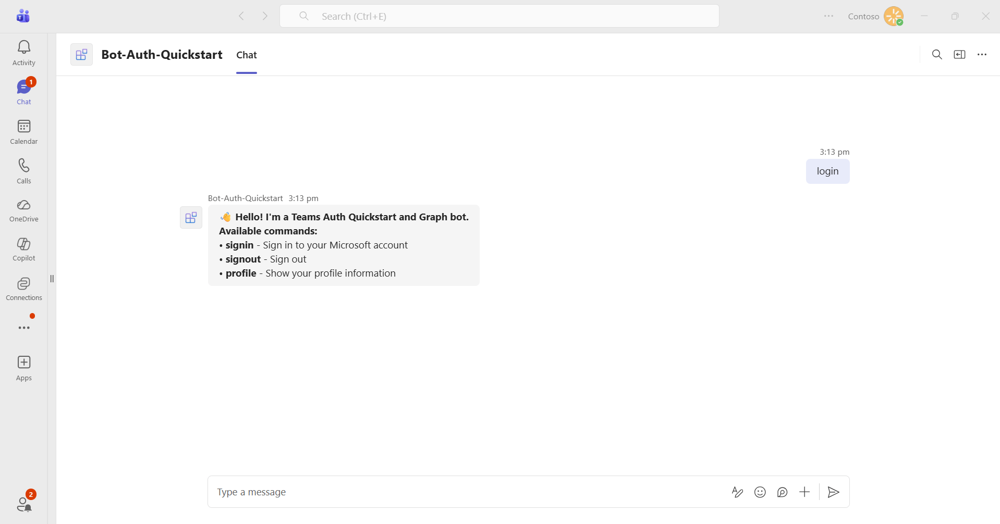

# Teams Bot Auth Quickstart

This sample demonstrates how to implement Single Sign-On (SSO) authentication for Microsoft Teams bots using Azure Active Directory. It showcases:

- **Authentication**: Seamless SSO authentication using Azure AD with OAuth support
- **Microsoft Graph Integration**: Access user data and perform operations on behalf of authenticated users

> If you do not have permission to sideload custom apps, Microsoft 365 Agents Toolkit will recommend creating and using a Microsoft 365 Developer Program account - a free program to get your own dev environment sandbox that includes Teams.

> **IMPORTANT**: The manifest file in this app requires the following fields for the Teams SDK OAuth flow:
> - **`validDomains`**: Must include `"token.botframework.com"` to allow the OAuth token flow.
> - **`webApplicationInfo`**: Must be configured with your Azure AD app's `id` (App Id / Client ID) and `resource` (e.g., `api://botid-{AppId}`). This is required for SSO authentication to work in Teams.
> Both fields must be present in any bot that uses Teams SSO or OAuth authentication.

## Table of Contents

- [Interaction with Bot](#interaction-with-bot)
- [Sample Implementations](#sample-implementations)
- [Microsoft Graph Integration](#microsoft-graph-integration)
- [Prerequisites](#prerequisites)
- [Setup Instructions](#setup-instructions)
  - [Option 1: Using Microsoft 365 Agents Toolkit](#option-1-using-microsoft-365-agents-toolkit-for-vs-code)
  - [Option 2: Manual Setup](#option-2-manual-setup)
- [Running the Sample](#running-the-sample)
- [Troubleshooting](#troubleshooting)
- [Further Reading](#further-reading)

## Interaction with Bot Application



The bot responds to the following commands:

- **signin** - Sign in using your Microsoft 365 account with SSO authentication
- **profile** - View your profile information (Name, Email, Job Title, Department, Office)
- **signout** - Sign out from the bot and clear authentication session

## Sample Implementations

| Language | Framework | Directory |
|----------|-----------|-----------|
| C# | ASP.NET Core | [dotnet/bot-auth-quickstart](dotnet/bot-auth-quickstart/README.md) |
| TypeScript | Node.js | [nodejs/bot-auth-quickstart](nodejs/bot-auth-quickstart/README.md) |
| Python | Python | [python/bot-auth-quickstart](python/bot-auth-quickstart/README.md) |

## Microsoft Graph Integration

This sample demonstrates comprehensive Microsoft Graph API integration to access Microsoft 365 data and services on behalf of authenticated users.

### Graph API Capabilities

The bot leverages Microsoft Graph to:

1. **User Profile Access**:
   - Retrieves authenticated user's profile information
   - Accesses user display name, email, job title, department, and office location
   - Uses delegated permissions on behalf of the signed-in user

### Graph API Permissions Used

This sample requires the following Microsoft Graph permissions:

**Delegated Permissions** (user or admin consent required):
- `User.Read` - Read the signed-in user's profile

### User Authentication Flow

The sample uses Azure AD SSO (Single Sign-On) with the Teams SDK OAuth flow:

1. User initiates login via the bot
2. Bot sends an Adaptive Card configured with the OAuth Signing Resource
3. Teams prompts the user for consent (on first use) — see [Consent Flow](#consent-flow) below
4. Bot exchanges the SSO token with permissions to access Graph resources
5. Bot makes Graph API calls on behalf of the user

### Consent Flow

Teams SSO involves two types of consent:

- **User consent**: On the first sign-in, the user is prompted to consent to the permissions (e.g., `User.Read`). After consent is granted, subsequent sign-ins are silent — no prompt is shown.
- **Admin consent**: An organization's administrator can pre-consent on behalf of all users in the tenant. If admin consent has been granted, individual users will not see a consent prompt.

> **Note**: If you need to reset consent and re-trigger the consent prompt (e.g., for testing), you can do so by:
> 1. Go to [My Apps](https://myapps.microsoft.com) → find your app → **Remove** it, or
> 2. In the [Azure Portal](https://portal.azure.com) → **Microsoft Entra ID** → **Enterprise Applications** → find your app → **Permissions** → **Revoke user consent**, or
> 3. Have the user sign out of the bot (`signout` command) and clear the Teams app cache.

### Graph API Endpoints Used

- `GET /me` - Get current user's profile

## Prerequisites

- Microsoft Teams is installed and you have an account (not a guest account)
- [M365 developer account](https://docs.microsoft.com/en-us/microsoftteams/platform/concepts/build-and-test/prepare-your-o365-tenant) or access to a Teams account with the appropriate permissions to install an app
- [dev tunnel](https://learn.microsoft.com/en-us/azure/developer/dev-tunnels/get-started?tabs=windows) or [ngrok](https://ngrok.com/download) latest version or equivalent tunneling solution
- Language-specific prerequisites:
  - **Node.js**: [NodeJS](https://nodejs.org/en/download/)
  - **.NET**: [.NET SDK](https://dotnet.microsoft.com/download)
  - **Python**: [Python](https://www.python.org/downloads/)

> **Note**: Authentication samples require Microsoft Teams and cannot be tested using the `agentsplayground` tool or the Teams SDK Dev Tools. The OAuth flow and SSO authentication features only work within the Teams client environment.

## Setup Instructions

### Option 1: Using Microsoft 365 Agents Toolkit

1. Ensure you have downloaded and installed [Visual Studio Code](https://code.visualstudio.com/docs/setup/setup-overview)
2. Install the [Microsoft 365 Agents Toolkit extension](https://marketplace.visualstudio.com/items?itemName=TeamsDevApp.ms-teams-vscode-extension)
3. Select **File > Open Folder** in VS Code and choose this sample directory (for Node.js/Python), or open the `.sln` solution file in Visual Studio (for .NET)
4. Using the extension, sign in with your Microsoft 365 account where you have permissions to upload custom apps
5. Select **Debug > Start Debugging** or **F5** to run the app in a Teams web client
6. In the browser that launches, select the **Add** button to install the app to Teams

> **Note**: If you use multiple browser profiles, ATK may open the default browser where your account is not signed in. If the app is not found, copy the URL from the default browser and paste it into your preferred browser profile.

### Option 2: Manual Setup

#### 1. Setup for Bot SSO

- Refer to [Bot SSO Setup document](BotSSOSetup.md)
- Ensure that you've [enabled the Teams Channel](https://docs.microsoft.com/en-us/azure/bot-service/channel-connect-teams?view=azure-bot-service-4.0)
- While registering the Azure bot, use `https://<your_tunnel_domain>/api/messages` as the messaging endpoint

> NOTE: When you create your app registration in Azure portal, you will create a ClientID and ClientSecret - make sure you keep these for later.

#### 2. Setup Local Tunnel

Create a persistent tunnel for port 3978 with anonymous access so it can be reused across projects:

```
devtunnel create -a my-tunnel
devtunnel port create -p 3978 my-tunnel
devtunnel host my-tunnel
```

Take note of the URL shown after *Connect via browser:*

#### 3. Register Azure AD Application

Register a new application in the [Microsoft Entra ID – App Registrations](https://go.microsoft.com/fwlink/?linkid=2083908) portal.

**A) Create New Registration:**
- Select **New Registration** and on the *register an application page*, set following values:
  - Set **name** to your app name
  - Choose the **supported account types** (any account type will work)
  - Leave **Redirect URI** empty
  - Choose **Register**

**B) Add Authentication Platform:**
- Under **Manage**, navigate to **Authentication**
- Click **Add a platform** and select **Web**
- Set the **Redirect URI** to `https://token.botframework.com/.auth/web/redirect`
- Click **Configure**

**C) Save Application Details (skip if already done):**
- On the overview page, copy and save the **Application (client) ID** and **Directory (tenant) ID**
- You'll need these later when updating your Teams application manifest and configuration files

**D) Create Client Secret:**
- Under **Manage**, navigate to **Certificates & secrets**
- In the **Client secrets** section, click on **+ New client secret**
- Add a description (e.g., "Teams Bot Secret") and select an expiration period
- Click **Add**
- **Important**: Copy the client secret **Value** immediately and save it securely. You won't be able to see it again!

**E) Configure API Permissions:**
- Navigate to **API Permissions**
- Click **Add a permission**
- Select **Microsoft Graph** -> **Delegated permissions**:
  - `User.Read` (enabled by default)
- Click **Add permissions**
- Click **Grant admin consent** to grant admin consent for the required permissions

#### 4. Setup Code

**Clone the repository:**

```bash
git clone https://github.com/OfficeDev/Microsoft-Teams-Samples.git
```

**Navigate to the sample directory:**

```bash
# For Node.js:
cd samples/bot-auth-quickstart/nodejs/bot-auth-quickstart
```

**Install dependencies:**

```bash
npm install
```

For .NET:
```bash
dotnet restore
```

For Python:
```bash
pip install -r requirements.txt
```

**Configure environment variables:**

Update the configuration file (`.env`, `appsettings.json`, or `.env` depending on language) with the values from step 3 (Azure AD app registration):

- `CLIENT_ID` - The Application (client) ID from step 3
- `CLIENT_SECRET` - The client secret value from step 3C
- `TENANT_ID` - Your Directory (tenant) ID from step 3 (required for SingleTenant)
- `CONNECTION_NAME` - The name of your Azure Bot OAuth connection created in step 1

#### 5. Setup Teams App

Navigate to the Teams Developer Portal at http://dev.teams.microsoft.com

**Create a new Bot resource:**
1. Navigate to **Tools** -> **Bot management**, and add a **New bot**
2. In **Configure**, paste the devtunnel endpoint URL and append `/api/messages`
3. In **Client secrets**, create a new secret and save it for later

> **Note**: If you have access to an Azure Subscription in the same Tenant, you can also create the Azure Bot resource ([learn more](https://learn.microsoft.com/en-us/azure/bot-service/abs-quickstart?view=azure-bot-service-4.0&tabs=singletenant)).

**Create a new Teams App:**
1. Navigate to **Apps** and create a **New App**
2. Fill the required values in **Basic information** (short and long name, descriptions, and App URLs)
3. In **App features** -> **Bot**, select the bot you created previously
4. Select **Preview in Teams**

#### 6. Start the Bot

For Node.js:
```bash
npm start
```

For .NET:
```bash
dotnet run
```

For Python:
```bash
python main.py
```

## Running the Sample

### Bot Commands

**Authentication:**
- **signin** - Sign in to the bot using your Microsoft 365 account
  - The bot will request your consent to access your profile information
  - After consent, the bot exchanges an SSO token and accesses Microsoft Graph on your behalf
  - You remain signed in until you explicitly sign out

**Profile:**
- **profile** - View your Microsoft 365 profile (Name, Email, Job Title, Department, Office)

**Sign Out:**
- **signout** - Sign out from the bot and clear your authentication session

## Troubleshooting

- If Teams cannot communicate with your bot, verify your DevTunnels URL is reachable
- Ensure your configuration file (`.env`, `appsettings.json`) is setup correctly
- Verify that "token.botframework.com" is included in `validDomains` in your manifest.json
- For OAuth issues, confirm your Azure AD app registration has the correct redirect URIs
- Check that admin consent has been granted for the required Graph API permissions
- Use the Channels UI in Azure Bot Service in the Azure Portal to see detailed endpoint errors (not available in Teams Developer Portal)

### Enabling Verbose Logs

Detailed logs can help diagnose authentication and connection issues.

**For .NET**, set the log level in `appsettings.json`:
```json
{
  "Logging": {
    "LogLevel": {
      "Default": "Debug",
      "Microsoft": "Debug"
    }
  }
}
```

**For Node.js (TypeScript)**, logging is configured directly in the app via `ConsoleLogger`:
```typescript
const app = new App({
  logger: new ConsoleLogger('@samples/bot-auth-quickstart', { level: 'debug' }),
});
```

**For Python**, logging is configured via `ConsoleLogger` in `main.py`:
```python
from microsoft_teams.common import ConsoleLogger, ConsoleLoggerOptions

logger = ConsoleLogger().create_logger("bot-auth-quickstart", ConsoleLoggerOptions(level="debug"))
app = App(logger=logger)
```

### Common Issues

**Consent not granted**
- The user declined the consent prompt or admin consent is required for the tenant.
- Ensure the Azure AD app has the correct API permissions configured and that you (or a tenant admin) have granted consent.
- Check that `webApplicationInfo` in `manifest.json` references the correct Application client ID.

**Invalid connection name**
- The OAuth connection name in your bot code does not match the connection name configured in Azure Bot Service.
- In the Azure Portal, go to your Azure Bot resource → **Settings** → **OAuth Connection Settings** and verify the connection name matches the value used in your code (e.g., `connectionName` in `.env` or `appsettings.json`).

**Invalid OAuth connection settings**
- The OAuth connection in Azure Bot Service is misconfigured (wrong client ID, client secret, or tenant ID).
- In the Azure Portal, open your OAuth Connection Settings and use the **Test Connection** button to validate the settings.
- Ensure the client secret has not expired and the Application (client) ID matches your Azure AD app registration.

**Redirect URI not set**
- The redirect URI required by the OAuth flow is missing from the Azure AD app registration.
- In the Azure Portal, open your app registration → **Authentication** → **Redirect URIs** and add `https://token.botframework.com/.auth/web/redirect`.

## Further Reading

### Teams Development
- [Teams SDK Documentation](https://learn.microsoft.com/microsoftteams/platform/) - Official Microsoft Teams platform documentation

### Authentication & Graph API
- [Teams Bot Authentication](https://learn.microsoft.com/microsoftteams/platform/bots/how-to/authentication/auth-aad-sso-bots) - SSO authentication for Teams bots
- [Microsoft Graph API](https://developer.microsoft.com/graph) - Access Microsoft 365 data and services
- [Graph API Permissions](https://learn.microsoft.com/graph/permissions-reference) - Complete permissions reference

### Tools & Resources
- [Microsoft 365 Agents Toolkit](https://marketplace.visualstudio.com/items?itemName=TeamsDevApp.ms-teams-vscode-extension) - VS Code extension for Teams development
- [Azure Bot Service](https://azure.microsoft.com/services/bot-services/) - Cloud-based bot development service
